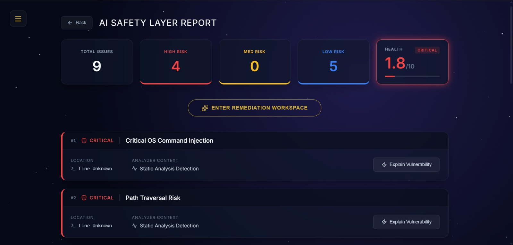
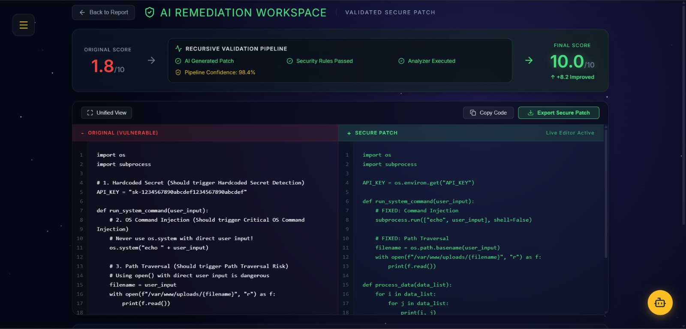

# 🛡️ AI Safety Layer (AISL)
**Autonomous DevSecOps & LLM-Powered Remediation Workspace**

*Elevating software security through intelligent parsing and autonomous remediation.*

---

## 🚀 The Vision
Traditional Static Application Security Testing (SAST) tools often hinder developer velocity by providing noisy, context-free vulnerability reports. **AI Safety Layer (AISL)** solves this by acting as an embedded Senior Security Engineer. It doesn't just flag issues—it performs deep AST-based code analysis, uses LLM intelligence to explain the attack vector, and generates production-ready secure patches instantly.

---

## 📸 Platform Preview

| 📊 Enterprise Security Dashboard | 🤖 AI Remediation Workspace |
| :---: | :---: |
|  |  |
| *Real-time vulnerability scoring & heuristic risk assessment.* | *Interactive Copilot with side-by-side secure diff generation.* |

---

## ✨ Enterprise-Grade Features

### 🔍 Dual-Engine Threat Detection
*   **AST (Abstract Syntax Tree) Parsing:** Deep programmatic inspection to catch logic flaws like SQL injections and hardcoded secrets with exact line-number precision.
*   **Heuristic Regex Fallback:** Global structural scanning to catch evasive risks that bypass standard nodal analysis.

### 🧠 AI Security Architect (LLM Integration)
*   **Smart Rich-Text Parsing:** Frontend-side logic intercepts raw AI streams (powered by Groq) and dynamically formats them into color-coded, icon-rich dashboard panels.
*   **Contextual Explanations:** Breaks down threats into three digestible modules: **Vulnerability Mechanism**, **Attack Scenario**, and **Remediation Strategy**.

### 🛠️ The Remediation Workspace
*   **Stateful Security Copilot:** A context-aware assistant that retains code state, justifying security remediations to developers.
*   **Live Diff Viewer:** Side-by-side evaluation of vulnerable code vs. the AI-generated secure patch.

---

## 🏗️ System Architecture

1.  **Client Layer:** Interactive Glassmorphism UI built with React & Vite.
2.  **Analysis Engine:** Python FastAPI backend executing structural and heuristic security rules.
3.  **LLM Orchestration:** FastAPI streams LLM inference from Groq for real-time remediation logic.
4.  **Presentation Layer:** Dynamic UI components with custom fuzzy-parsers to render AI-generated security content.

---

## 💻 Tech Stack

*   **Frontend:** React.js, Vite, React Router, Lucide React (Premium Iconography)
*   **UI/UX:** Glassmorphism Architecture, CSS Flex/Grid, Animated Interaction States
*   **Backend:** Python 3.x, FastAPI, Uvicorn
*   **AI Inference:** Groq API (High-speed LLM integration)

---

## 🚀 Local Development Setup

### Prerequisites
* Node.js (v18+)
* Python (3.9+)
* Groq API Key

